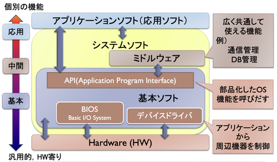

# ソフトウェア工学  
## ソフトウェアについて  

  
ソフトウェアは情報を扱うプロダクトそのもの、プロダクトを提供する手段である。ソフトウェアは劣化はしないが悪化はするため、新しい環境や技術ニーズを満たすビジネス要求に適用できるようにするように進化し続ける必要がある。また、より近代的なシステムやデータベースと相互運用するため拡張されなければならないという特徴もある。    
ソフトウェア工学とはIEEEによるとソフトウェアの開発、運用、メンテナンスに対するシステマティックで規律ある定量的なアプローチの適用をする学問であり、ソフトウェア工学の目的は進化論に基づく(ソフトウェアシステムが変化し続ける状況に対応する)方法論を考え出すことである。この学問はソフトウェアの大規模化と複雑化、IT人材の不足、社会性と求められるミッション、不確実性の増大などにより必要とされている。    
ソフトウェアの誕生からソフトウェアの廃止までのソフトウェアサイクルは以下のような手順で行われる。  
・企画・計画  
・要件定義  
・設計  
・制作  
・テストとデバック  
・運用・保守  
・廃止  
企画・計画ではビジネス上あるいはシステム上の要求を具現化するために行われる。要件定義ではシステムの目的、概要、機能、構成などを明確にし、スコープの共有や社内外への宣言と協力依頼、RFPなどのために行う。設計では要件定義書から設計書へと変えるもので、コーディングができるレベルの仕様書に落とし込む。制作では設計書に従いシステムを構成する。このとき、自社開発である内製と外部委託である調達に分かれるが、この際、賃金の安い海外企業に外部委託をするオフショア開発というものが行われることがある。テストとデバックでは、バグのないソフトウェアはないと考え、ソフトウェアのどの部分をテストし、どの程度テストするのかなどを決めテストを行う。    
プロジェクトは有期性と独自性を持ち、今の立ち位置から順に目標に進むフォアキャスティングと目標に向けて何が必要か計画し達成に向かうという逆算的なバックキャスティングがある。  
---  
## ソフトウェア分析  
ソフトウェアを見える化するための手法として以下が挙げられる。  
・物量に関する分析  
・実行性能に関する分析  
・開発工数に関する分析  
・品質に関する分析  

## ソフトウェアの評価  
ソフトウェアの評価は価値を図ることで以下の方法で評価を行う。  
1. コードの物量(ステップ数) ・・・c言語換算でのソースコード数  
2. コードの物量(オブジェクト容量)  
3. ファンクションポイント法・・・プログラミングフェーズに入る前にユーザ要件が定まり、必要な機能が見えてきた段階でシステム規模を概算できる  
4. 使い勝手  

## 開発プロセス  
1. ウォーターフォール開発型プロセス  
要件定義から総合テストまでの工程を順番に行っていく開発方法であり、進捗管理が容易で成果物が明確であるというメリットがある一方、後工程にしわ寄せが行きやすい開発プロセスである。  
2. スパイラルモデル  
プログラム開発を小さなフェーズに分解し、フェーズごとにプロトタイプによるデモンストレーションを行い、フィードバックをする。プロトタイプ作成に想定外の作業量が発生するリスクがある。  
3. 反復型開発プロセス  
ソフトウェアを機能分割し、これを反復と呼ぶ単位で管理する。部分的に完成させるため顧客の要求を受け入れやすく、部分的に納品ができるが、全体像が見づらく分割のための作業が増え、一括して稼働するシステムで意味がなくなってしまう。  
4. アジャイルシステム  
変化に対応して無駄を排し、最適な手法で動くソフトウェアの提供を優先する。  
・スクラム  
アジャイル開発の代表的な手法であり、スプリントと役割分担に基づいて進行する。役割はプロダクトオーナー、スクラムマスター、開発チームに分かれ、1~4週間単位で開発を行う。  
・カンバン  
視覚的な作業管理ボードを用いてタスクの状態(To Do,In Orogress,Done)を見える化する。これにより、タスクの追加や変更が容易になることでプランニングが柔軟になったり、サイクル期間を短縮できたり、ワークフローを可視化できたりするメリットがある。  
・XP  
開発者の視点に特化したアジャイル手法で高品質コードと柔軟な変更対応を両立することを目的とする。  

これらの開発手法は重要度、人(メンバーのレベル)、規模(人数)、文化、変化の度合いをもとに決定するが、実際に現場ではこれらの開発手法を組み合わせたハイブリッド型が使われることが多くなっている。  

## WBS
WBSとはプロジェクト目標を達成し、必要な成果物を生成するためにプロジェクトチームが実行する作業を要素成果物を主体に要素分解したものである。WBSのメリットとしては  
1. スコープが明確になる  
2. 作業を洗い出せる  
3. 全体管理と作業計画が明確化される  
4. プロジェクト実施時はWBSに則り実行するだけ  
というのがあげられる。  